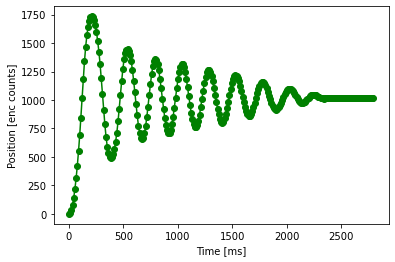
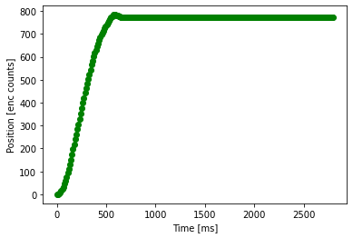
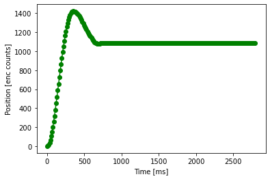

## Created by Rees Verleur, Tristan de Lemos, and Trenten Spicer
\
\
Our closed loop controller takes in a set point, a point at which to stop the motor, and a gain, a value to which how fast the motor should get to this position. If the gain is 1 or greater, the motor will become unstable and oscillate over the set point and gradually grow larger. \
\
We have made a separate class file, pro_control.py, that defines all of the functions we need for our closed loop controller. When initialized, the gain is set to 1 and the set point is 0, so the motor will not move.\
Our three test cases show under damped, over damped, and just right.\cf2 \cb3 \expnd0\expndtw0\kerning0
\
\
motor_controller.py is considered our main python file, using all of the classes together to perform the lab. motor_reader.py is the program we used on the terminal to set the set point and gain, and also obtain plots of our motor performance.\
\

\

\
